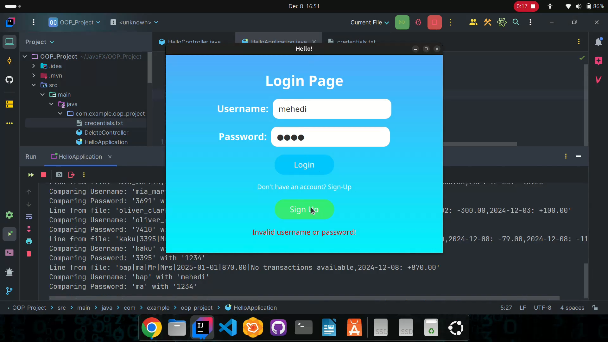
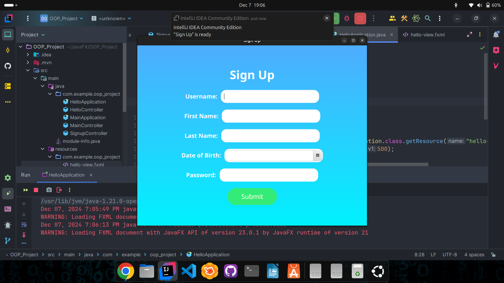
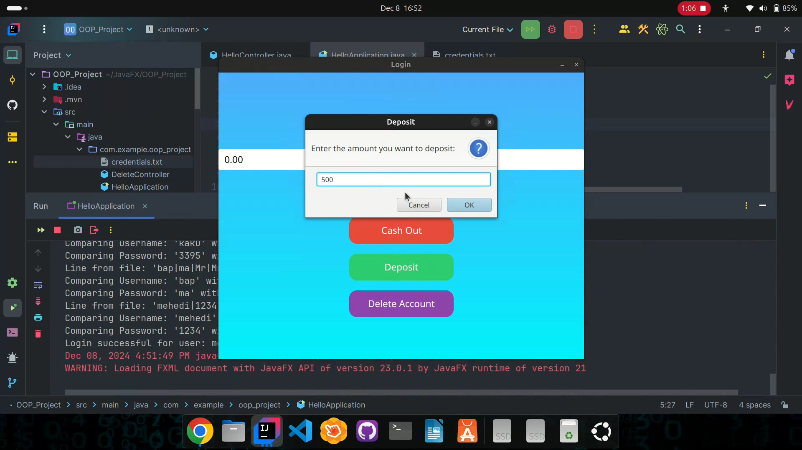
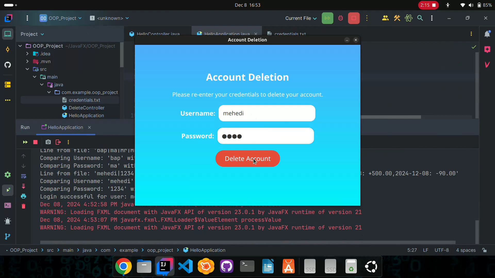

# 💰 JavaFX Banking System

Welcome to the **JavaFX Banking System**, a desktop application that provides users with a seamless interface for managing their accounts, performing transactions, and handling account-related operations with ease.

---

## ✨ Features

- **🔐 Secure Login System**
  - Authenticate users with credentials stored in a text file.
  - Easy-to-use login interface.

- **🔐 Create Account**
  - Create new user and add to Bank Database.
  - Easy-to-use signup interface.   

- **💵 Account Management**
  - **Deposit Funds:** Add money to your account with instant updates.
  - **Cash Out:** Withdraw funds securely with balance validation.
  - **Check Balance:** View your current balance in real time.

- **🗑️ Account Deletion**
  - Remove user accounts permanently after validating credentials.
  - Updates the data file without affecting other users.

- **📂 Persistent Data**
  - User data is stored in a text file for offline functionality.
  - Automatic updates to the text file after every transaction.

---

## 🚀 Technology Stack

- **Programming Language**: Java
- **UI Framework**: JavaFX
- **Tools**:
  - Scene Builder for FXML file design.
  - File handling for data persistence.

---

## 📂 Screenshots

1. **Login Screen**:
   -  
     
2. **SignUP Screen**:
   -  

3. **Main Menu Screen**:
   -  

4. **Transaction Process**:
   -  

5. **Delete Account**:
   -  

---

## 🛠️ How It Works

1. **Login**: Enter your username and password to access your account.
2. **Perform Transactions**: 
   - Deposit or withdraw funds.
   - View your transaction history and balance.
3. **Account Deletion**: Securely delete your account if no longer needed.

Data is saved in a structured format:
 - username|password|firstname|lastname|DateOfBirth|CurrentBalance|TransactionHistory

## 🖥️ Installation & Setup

1. **Clone the repository:**
   ```bash
   git clone https://github.com/your-username/javafx-banking-system.git
   cd javafx-banking-system
2. **Open the project in your favorite IDE (e.g., IntelliJ IDEA).**
3. **Ensure you have JavaFX dependencies configured:**
   ```bash
   <dependency>
     <groupId>org.openjfx</groupId>
     <artifactId>javafx-controls</artifactId>
     <version>21</version>
   </dependency>
4. **Run the application:** Execute the HelloApplication class to start the system.

## 🤝 Contributing
 - Contributions are always welcome!
 - Feel free to submit a pull request or open an issue to report bugs or suggest improvements.

## 👨‍💻 Author
  - **Mehedi Hasan**
      - 🌟 Undergraduate Student, CSE, University of Dhaka

## 🎯 Future Enhancements
   - Add more advanced features like password recovery.
   - Implement graphical transaction history.
   - Upgrade to use a database for larger-scale operations.

## 📂 Project Structure:
javafx-banking-system/
├── src/
│   ├── main/
│   │   ├── java/
│   │   │   └── com/
│   │   │       └── example/
│   │   │           └── oop_project/
│   │   │               ├── HelloApplication.java  # Main application entry point
│   │   │               ├── HelloController.java   # Login controller
│   │   │               ├── MainController.java    # Dashboard controller
│   │   │               ├── DeleteController.java  # Account deletion logic
│   │   │               └── User.java              # User data model
│   │   └── resources/
│   │       ├── com/
│   │       │   └── example/
│   │       │       └── oop_project/
│   │       │           ├── hello-view.fxml        # Login screen layout
│   │       │           ├── main-view.fxml         # Dashboard layout
│   │       │           └── deleteaccount.fxml     # Account deletion layout
│   │       ├── css/
│   │       │   └── styles.css                     # Custom styles for the UI
│   │       └── screenshots/
│   │           ├── login.png                      # Screenshot of the login screen
│   │           ├── dashboard.png                  # Screenshot of the dashboard
│   │           └── transactions.png               # Screenshot of a transaction flow
│   └── test/
│       └── java/
│           └── com/
│               └── example/
│                   └── oop_project/
│                       └── ApplicationTests.java  # Optional unit tests
├── .gitignore                                     # Files to ignore in version control
├── README.md                                      # Project documentation
├── pom.xml                                        # Maven configuration file
└── credentials.txt                                # User data (for development purposes)
